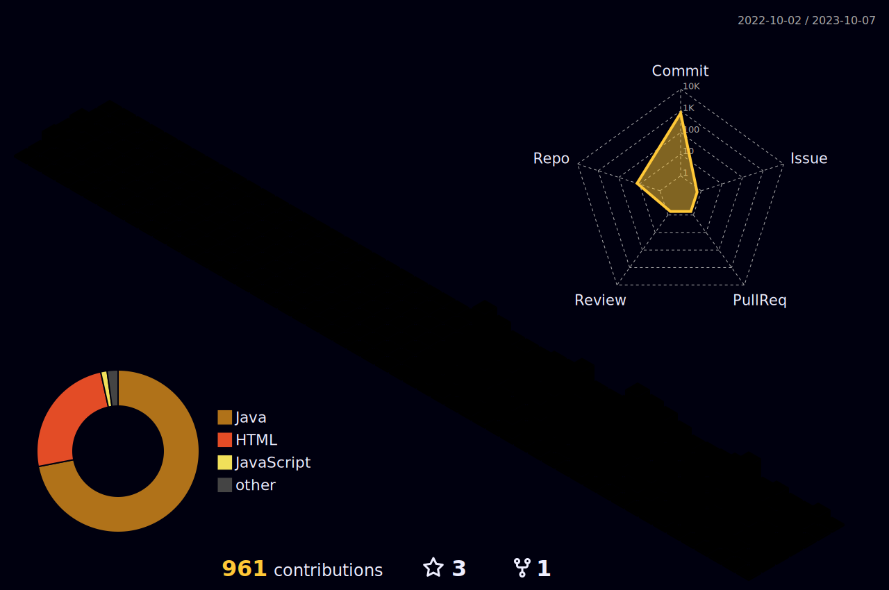

------------

  <h1>💻 Tech Stack 💻</h1>
  <h3>Used As Main</h3>
  
   
  
  
   
  
  
  
   
  
  
  
  
   
  
  
   
  
  
  
  
  
  <h3>Used As Least Once</h3>
  
  
  
   
  
  
  
  <h3>IDE</h3>
  
  
  
  <h3>Cowork tool</h3>
  
  
  
  
  

------------

<!--
**SangkiHan/SangkiHan** is a ✨ _special_ ✨ repository because its `README.md` (this file) appears on your GitHub profile.

Here are some ideas to get you started:

- 🔭 I’m currently working on ...
- 🌱 I’m currently learning ...
- 👯 I’m looking to collaborate on ...
- 🤔 I’m looking for help with ...
- 💬 Ask me about ...
- 📫 How to reach me: ...
- 😄 Pronouns: ...
- ⚡ Fun fact: ...
-->
